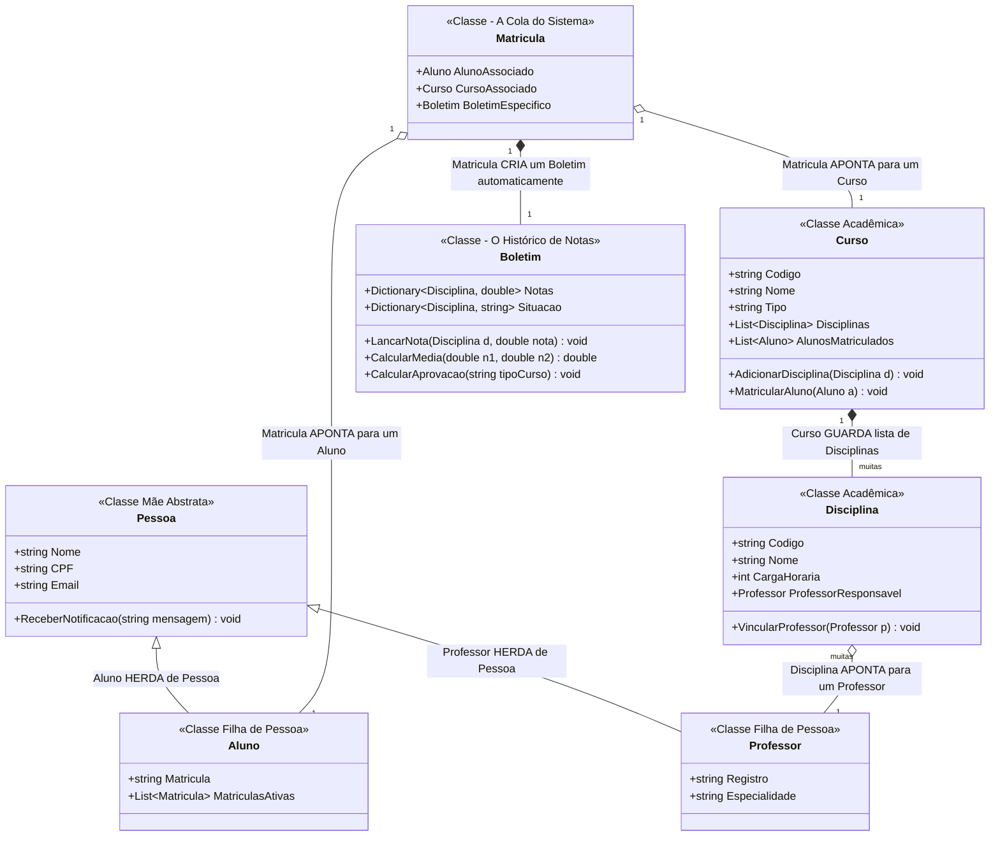

# 🏛️ Arquitetura do Sistema e Modelagem de Classes

Este cartão centraliza o mapa visual da nossa Programação Orientada a Objetos (POO) para o Sistema de Gestão de Faculdade.
Ele serve como o guia oficial para sabermos os atributos e métodos de cada arquivo do projeto.

## 📊 Diagrama de Classes (Visual)

---

## 📖 Legenda Oficial de Notações POO

### 🔍 Modificadores de Acesso (Sinais)

* **`+` (Public):** Visível para qualquer arquivo. Usado em quase todo o projeto para que as classes e métodos das colegas consigam conversar entre si.
* **`-` (Private):** Oculto. Apenas a própria classe pode ler (ótimo para funções de validações internas de segurança).
* **`#` (Protected):** Visível apenas na Classe Mãe (`Pessoa`) e nas Classes Filhas (`Aluno` / `Professor`).

### 📐 Estruturas de Flechas Universais (Relacionamentos)

* **`<|--` (Herança):** Indica que uma classe filha herda tudo da classe mãe. *(Exemplo: Aluno é uma Pessoa)*.
* **`*--` (Composição Rígida):** Forte dependência. As duas coisas nascem e morrem juntas. *(Exemplo: Se deletar a Matrícula, o Boletim dela some junto)*.
* **`o--` (Associação / Agregação):** Ligação independente. Aponta para algo que já existe fora dali. *(Exemplo: A Disciplina aponta para um Professor já cadastrado)*.

### 📊 Multiplicidades

* **`"1" *-- "muitas"`:** Sinaliza a existência de coleções, arrays ou listas (`List<Disciplina>`) para armazenar múltiplos dados dentro de um objeto.
